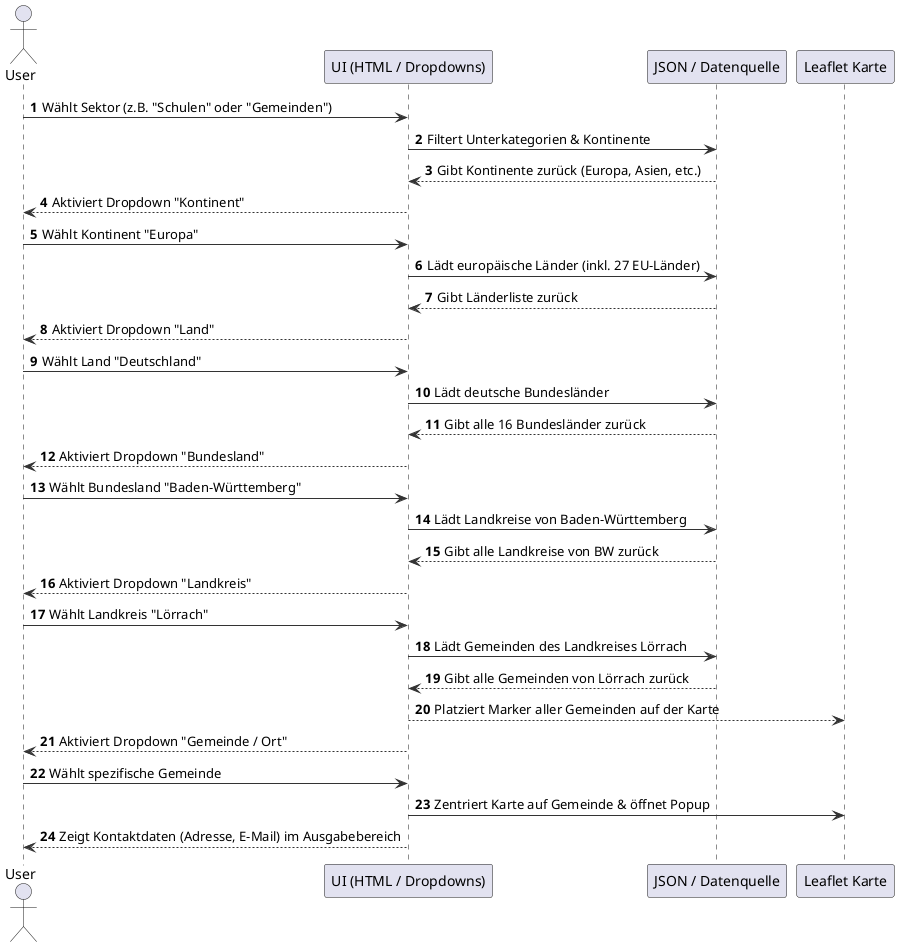

```plantuml
@startuml
skinparam backgroundcolor #FFFFFF
skinparam DefaultFontColor #000000
skinparam ClassBackgroundColor #F9F9F9
skinparam ClassBorderColor #333333
skinparam ArrowColor #333333
autonumber
actor User as U
participant "UI (HTML / Dropdowns)" as UI
participant "JSON / Datenquelle" as DB
participant "Leaflet Karte" as Map

U -> UI: Wählt Sektor (z.B. "Schulen" oder "Gemeinden")
UI -> DB: Filtert Unterkategorien & Kontinente
DB --> UI: Gibt Kontinente zurück (Europa, Asien, etc.)
UI --> U: Aktiviert Dropdown "Kontinent"

U -> UI: Wählt Kontinent "Europa"
UI -> DB: Lädt europäische Länder (inkl. 27 EU-Länder)
DB --> UI: Gibt Länderliste zurück
UI --> U: Aktiviert Dropdown "Land"

U -> UI: Wählt Land "Deutschland"
UI -> DB: Lädt deutsche Bundesländer
DB --> UI: Gibt alle 16 Bundesländer zurück
UI --> U: Aktiviert Dropdown "Bundesland"

U -> UI: Wählt Bundesland "Baden-Württemberg"
UI -> DB: Lädt Landkreise von Baden-Württemberg
DB --> UI: Gibt alle Landkreise von BW zurück
UI --> U: Aktiviert Dropdown "Landkreis"

U -> UI: Wählt Landkreis "Lörrach"
UI -> DB: Lädt Gemeinden des Landkreises Lörrach
DB --> UI: Gibt alle Gemeinden von Lörrach zurück
UI --> Map: Platziert Marker aller Gemeinden auf der Karte
UI --> U: Aktiviert Dropdown "Gemeinde / Ort"

U -> UI: Wählt spezifische Gemeinde
UI -> Map: Zentriert Karte auf Gemeinde & öffnet Popup
UI --> U: Zeigt Kontaktdaten (Adresse, E-Mail) im Ausgabebereich

@enduml
```
